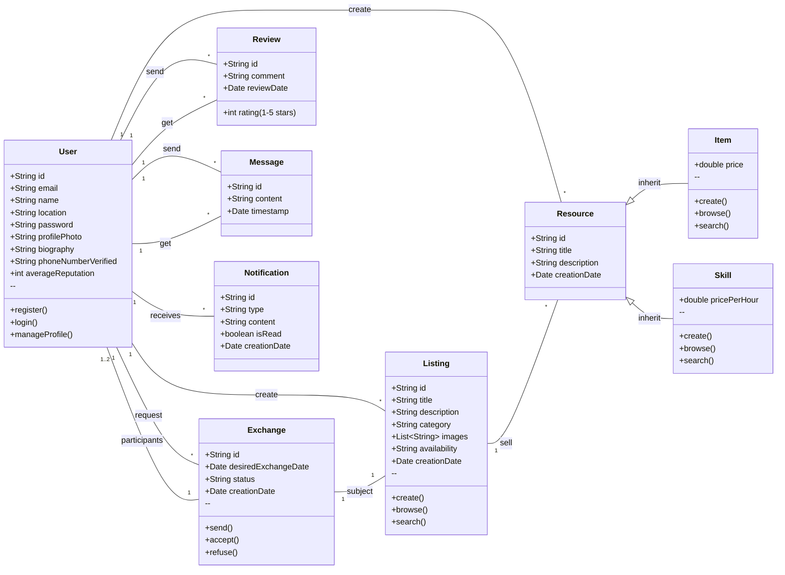

# Projet de synthèse 
## Une application d’échange local de biens et de compétences

### Élicitation

1. <u>Authentification des Utilisateurs</u>
    — Inscription et Profil Utilisateur : Un nouvel utilisateur peut s’inscrit en fournissant son email, son nom
et sa localisation générale afin d’accéder à la plateforme.
    — Connexion Sécurisée : Utilisateur enregistré peut se connecter afin que ses données et ses transactions
soient privées.
    — Gestion du Profil : Un utilisateur peut ajouter une photo de profil, une courte biographie et vérifier son
numéro de téléphone pour instaurer la confiance au sein de la communauté.
2. <u>Gestion des Annonces d’Objets</u>
    — Créer une Annonce d’Objet : Un utilisateur identifié peut créer une annonce pour un objet qu’il veut
prêter ou donner en fournissant un titre, une description, une catégorie, des images, et en précisant sa
disponibilité. Il peut également ajouter un commentaire supplémentaire indiquant l’objet ou la compé-
tence avec lequel il souhaite échanger son objet.
    — Parcourir et Rechercher des Annonces : Un utilisateur peut parcourir toutes les annonces disponibles,
filtrer par catégorie et rechercher par mots-clés pour trouver ce qu’il recherche.
    — Voir les Détails d’une Annonce : Un utilisateur peut voir une page détaillée pour toute annonce,
affichant toutes les informations et le profil du créateur de l’annonce.
3. <u>Gestion des Échanges de Compétences</u>
    — Proposer une Compétence : Un utilisateur enregistré peut créer une annonce pour une compétence
qu’il offre en fournissant un titre, une description et ses disponibilités. Il peut également préciser dans
un commentaire l’objet ou la compétence qu’il souhaite bénéficier en retour.
    — Parcourir les Compétences : Un utilisateur peut parcourir et rechercher les compétences disponibles
offertes par d’autres dans sa région.
4. <u>Flux de Transaction d’Échange</u>
    — Envoyer une Demande d’Échange : En tant que bénéficiaire, je peux répondre à une annonce d’échange
(une annonce d’un objet ou une compétence), en précisant l’objet ou la compétence que j’offre en retour
et la date précise de l’échange.
    — Gérer les Demandes : En tant que donateur, je peux voir mes demandes et accepter ou refuser des
propositions d’échange.
    — Messagerie : En tant qu’utilisateur, une fois une demande acceptée, je peux envoyer un message à
l’autre partie pour finaliser la logistique (lieu de rendez-vous) en utilisant un système de chat intégré à
l’application.
5. <u>Système de Réputation et de Confiance</u>
    — Avis et Notation : Après qu’un échange est terminé, les deux utilisateurs peuvent laisser une notation
publique (1 à 5 étoiles) et un avis l’un pour l’autre.
6. <u>Système de notification</u>
    — Notifications : Les utilisateurs reçoivent des notifications par email ou sur l’application pour les nouvelles
demandes, les messages et les mises à jour des demandes

### Spécifications
- dans le fichier ```SRS.md```

### Architecture

Nous utiliserons dans ce projet le Pattern Client-Serveur qui est le plus adapté pour un projet local et comunautaire.

### Conception

- **Observer**	pour Notification.

- **Factory** Pour Listing (Service de création)


### Modélisation UML

